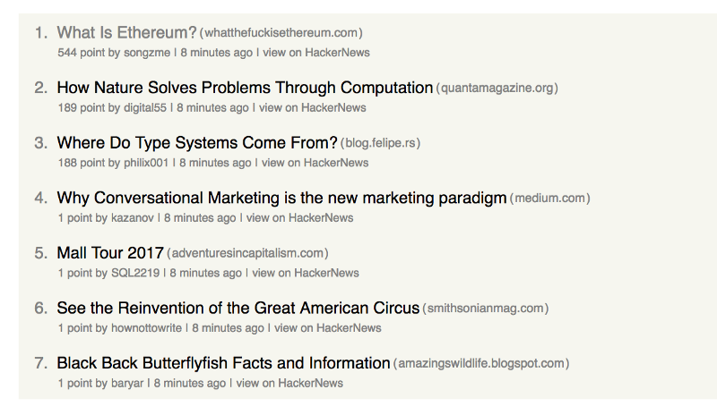

# How to build a simple HackerNews feed with styled-components

Some weeks ago I stumbled over an impressive new library called styled-components. It does not only enable you to write actual CSS in your JavaScript but also binds the styles automatically to ReactJS components. Learn more about this at [their official docs](https://www.styled-components.com/) and [this video](https://www.styled-components.com/docs/basics#motivation).

Being inspired by [a blog post](https://daveceddia.com/learn-react-with-copywork/) from [Dave Ceddia](https://medium.com/@dceddia) about learning while copying existing products, I came up with the idea of building a small story feed for the [HackerNews](https://news.ycombinator.com/newest) page while trying out styled-components.

# What will we build?
In this post, I will focus on building the components for one HackerNews story and the list which represents the feed. Future posts will handle the other topics like connecting the app to the HackerNews API.

Over the course of this article, I'm going to show you some code snippets of the components that I created. At the end, there will be a runnable code snippet, so you can actually see what we built. And now, let's start with the setup.

# Setting up the project

I’m going to assume that you already have your environment set up and installed node and npm, as well as create-react-app.

Now you can go ahead and generate the app by running the following command: `create-react-app hackernews-client`

After the required packages have been downloaded and the app has been generated, you can run the project by running npm start in the root folder of your generated app.

Since we want to try out styled-components, you have to install it with `npm install -S styled-components`