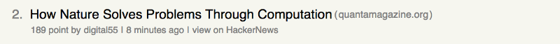

# The "_Story_" component

First of all, let’s start with the smallest part of the app: The list item which represents an entry / a story on HackerNews.



This is what the “Story” component will look like
This component consists of several parts. I split it into a header and a footer, which may not be the right wording, but “content” also didn’t sound very good to me.

## Header

* Rank
* Title
* Link to the source homepage

## Footer

* Score
* User who posted the story
* Timestamp
* A link to the original story on HackerNews to follow the discussion

And now comes the fancy part: Instead of cluttering the component with divs, spans and links and instead of creating a stylesheet containing different styles for a link in the footer and the title itself, we will create some styled-components instead and put them into the _Header_ and _Footer_ components.

Starting with the _Header_ component, there will be a styled component for the rank, title and the link to the source homepage. It will get the rank, title and URL passed through props:

```javascript
import React from "react";
import PropTypes from "prop-types";
import * as utils from "../../utils/helper";

import {
  HeaderWrapper,
  RankContainer,
  Title,
  SourceContainer,
  SourceLink
} from "./Styles";

export default function Header(props) {
  let url = props.url;
  let sourceUrl;

  if (!url) {
    url = utils.getItemUrl(props.itemId);
  }

  sourceUrl = utils.getSourceUrl(url);

  return (
    <HeaderWrapper>
      <RankContainer>
        {props.rank}.
      </RankContainer>
      <Title href={url}>
        {props.title}
      </Title>
      <SourceContainer>
        (<SourceLink href={"http://" + sourceUrl}>{sourceUrl}</SourceLink>)
      </SourceContainer>
    </HeaderWrapper>
  );
}

Header.propTypes = {
  itemId: PropTypes.number.isRequired,
  rank: PropTypes.number.isRequired,
  title: PropTypes.string.isRequired,
  url: PropTypes.string
};

```

As you can see, styled-components creates React components by calling functions for the respective HTML element, passing plain CSS. The fancy syntax you can see here is a new ES6 functionality called [tagged template literals](https://developer.mozilla.org/en-US/docs/Web/JavaScript/Reference/Template_literals).
Basically, I put the child components of the header inside a wrapper component which is used as a flex container to arrange all elements inside it horizontally. Then I created a styled component for each of the above mentioned items and arranged them within _HeaderWrapper_.

Now take a closer look at the Title component, you can see that I was able to set the target property of the a tag to a new blank page just by calling the attrs function and passing the respective attribute.

From my point of view, shifting attributes to the creation of styled components and not having to map a class name of a style to a component leads to a more readable component structure later on in the _Header_ or _Footer_ components.

Similar to this, I created the _Footer_ component:

```javascript
import React from "react";
import PropTypes from "prop-types";

import { FooterWrapper, FooterLink } from "./Styles";
import * as utils from "../../utils/helper";

export default function Footer(props) {
  const userUrl = utils.getUserUrl(props.username);
  const itemUrl = utils.getItemUrl(props.itemId);

  return (
    <FooterWrapper>
      {props.score} point by
      <FooterLink href={userUrl}>{props.username}</FooterLink>
      |
      <FooterLink>{new Date(props.timestamp * 1000).toDateString()}</FooterLink>
      |
      <FooterLink href={itemUrl}>view on HackerNews</FooterLink>
    </FooterWrapper>
  );
}

Footer.propTypes = {
  username: PropTypes.string.isRequired,
  itemId: PropTypes.number.isRequired,
  score: PropTypes.number.isRequired,
  timestamp: PropTypes.number.isRequired
};

```

As you can see, the time stamp is still just static text, since this will eventually become a separate component which calculates the time passed since the story was posted and brings it in a format like “8 minutes ago”, “17 hours ago” or “3 days ago”. Nevertheless, creating such a component is not in the scope of this blog post.

Like the _Header_, this _Footer_ component will get some information about the story passed through props and is again just a composition of different styled components.

Again, there is a wrapper component which handles the font-size used in the footer and will contain the rest of the items. Since the _Footer_ only consists of plain text and links, I only need a _FooterLink_ component, which opens the given link in a new window (see the target attribute).

Now that we finished both the header and the footer, we can put them where they belong and finalize the _Story_ component:

```javascript
import React, { Component } from "react";
import PropTypes from "prop-types";

import { Wrapper } from "./Styles";
import Header from "./Header";
import Footer from "./Footer";

export default class Story extends Component {
  render() {
    const item = this.props.item;

    return (
      <Wrapper>
        <Header
          itemId={item.id}
          url={item.url}
          title={item.title}
          rank={item.rank}
        />
        <Footer
          username={item.by}
          score={item.score}
          timestamp={item.time}
          itemId={item.id}
        />
      </Wrapper>
    );
  }
}

Story.propTypes = {
  item: PropTypes.object.isRequired
};

```