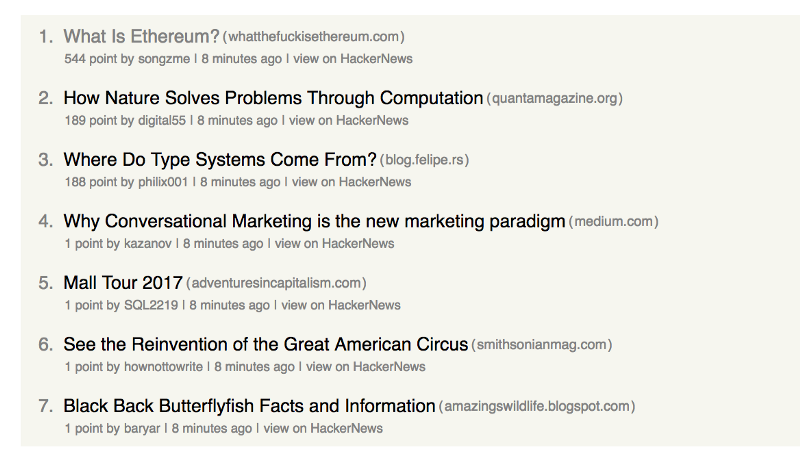
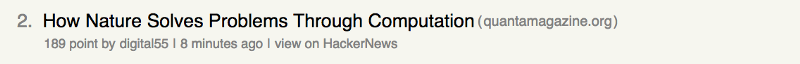

# How to build a simple HackerNews feed with styled-components

Some weeks ago I stumbled over an impressive new library called styled-components. It does not only enable you to write actual CSS in your JavaScript but also binds the styles automatically to ReactJS components. Learn more about this at [their official docs](https://www.styled-components.com/) and [this video](https://www.styled-components.com/docs/basics#motivation).

Being inspired by [a blog post](https://daveceddia.com/learn-react-with-copywork/) from [Dave Ceddia](https://medium.com/@dceddia) about learning while copying existing products, I came up with the idea of building a small story feed for the [HackerNews](https://news.ycombinator.com/newest) page while trying out styled-components.

# What will we build?
In this post, I will focus on building the components for one HackerNews story and the list which represents the feed. Future posts will handle the other topics like connecting the app to the HackerNews API.

# Setting up the project

I’m going to assume that you already have your environment set up and installed node and npm, as well as create-react-app.

Now you can go ahead and generate the app by running the following command: `create-react-app hackernews-client`

After the required packages have been downloaded and the app has been generated, you can run the project by running npm start in the root folder of your generated app.

Since we want to try out styled-components, you have to install it with `npm install -S styled-components`

# The "_Story_" component

First of all, let’s start with the smallest part of the app: The list item which represents an entry / a story on HackerNews.

This is what the “Story” component will look like
This component consists of several parts. I split it into a header and a footer, which may not be the right wording, but “content” also didn’t sound very good to me.

# Header

* Rank
* Title
* Link to the source homepage

# Footer

* Score
* User who posted the story
* Timestamp
* A link to the original story on HackerNews to follow the discussion

And now comes the fancy part: Instead of cluttering the component with divs, spans and links and instead of creating a stylesheet containing different styles for a link in the footer and the title itself, we will create some styled-components instead and put them into the _Header_ and _Footer_ components.

Starting with the _Header_ component, there will be a styled component for the rank, title and the link to the source homepage. It will get the rank, title and URL passed through props:

@[The header component]({ 
    "stubs": [
        "src/components/Story/Header.js",
        "src/components/Story/Footer.js",
        "src/components/Story/Styles.js",
        "src/components/Story/index.js",
        "src/container/StoryList.js",
    ], 
    "command": "./run.sh", 
    "layout": "aside" })

As you can see, styled-components creates React components by calling functions for the respective HTML element, passing plain CSS. The fancy syntax you can see here is a new ES6 functionality called [tagged template literals](https://developer.mozilla.org/en-US/docs/Web/JavaScript/Reference/Template_literals).
Basically, I put the child components of the header inside a wrapper component which is used as a flex container to arrange all elements inside it horizontally. Then I created a styled component for each of the above mentioned items and arranged them within _HeaderWrapper_.

Now take a closer look at the Title component, you can see that I was able to set the target property of the a tag to a new blank page just by calling the attrs function and passing the respective attribute.

From my point of view, shifting attributes to the creation of styled components and not having to map a class name of a style to a component leads to a more readable component structure later on in the _Header_ or _Footer_ components.

Similar to this, I created the _Footer_ component:

[Footer CODE HERE]

As you can see, the time stamp is still just static text, since this will eventually become a separate component which calculates the time passed since the story was posted and brings it in a format like “8 minutes ago”, “17 hours ago” or “3 days ago”. Nevertheless, creating such a component is not in the scope of this blog post.

Like the _Header_, this _Footer_ component will get some information about the story passed through props and is again just a composition of different styled components.

Again, there is a wrapper component which handles the font-size used in the footer and will contain the rest of the items. Since the _Footer_ only consists of plain text and links, I only need a _FooterLink_ component, which opens the given link in a new window (see the target attribute).

Now that we finished both the header and the footer, we can put them where they belong and finalize the _Story_ component:

[Story CODE HERE]

# The _“StoryList”_ component

Now that we created a component which represents one item in the list, we still need to build the list component to be able to display a bunch of stories.

The StoryList component will receive an array of stories to render a `<Story>` once per item in the list. In this case, the rank will be calculated by the index of the item within the array since this will not be part of the story item we get from the API later.

[StoryList CODE HERE]

# The App

Now we just have to use the `<StoryList>` component somewhere in the app, and pass an array of HackerNews stories and it will render a list item for each of them. Since I did not use the API yet, I just used a [static array](https://github.com/areiterer/hackernews-client/blob/master/src/api.js) with sample stories which I manually got from the API for the purpose of creating the basic components.

Since the App component is the root of the application, i also used it to define some global CSS rules. Styled-Components provides functionality to inject CSS globally, but they do only recommend to use it for styling the body or defining the font-face globally. (See [injectGlobal](https://www.styled-components.com/docs/api#injectglobal))

[App CODE HERE]

As you can see, I retrieve my stories from my static API within componentWillMount and put them into the state. This will change as soon as the app will fetch new Stories from the API, which I will handle in a later blog post.

Now that everything is tied together, the app renders a list of a few HackerNews stories with a similar styling to the original HackerNews list.

# What did we learn?

I did not yet fully discover and use every feature of styled-components, but I hope I could show you the basic ideas behind it. I'm amazed of the positive effect of such little things like not having to add class names to components or having to maintain one big or multiple smaller CSS files instead of keeping the style as close to the component as possible.

If you're like me, it might take some time for you until you get used to this (kind of) different way of thinking, but once you get the hang of it, you want to make everything a styled component 🙂

# Wrap up 
Thank you for reading to the end! This is the first post I have ever written - and also the first one that I posted on tech.io, so I really appreciate every kind of feedback. 

This article was originally published at [my blog](http://www.andreasreiterer.at/web-development/styled-components-hackernews-feed/). If you liked it, please have a look at my other posts there.